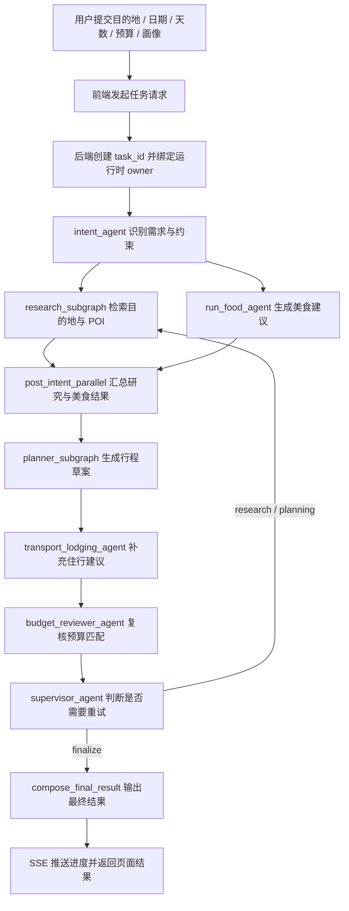

# 智能旅游助手

面向单实例使用场景的智能旅游规划应用，基于 `FastAPI + 原生 JavaScript + LangGraph` 构建，集成高德地图、天气、POI、路线、票务与报告导出能力。

## 项目概述

智能旅游助手是一个面向实际出行场景的旅游规划应用，目标不是简单生成一段“推荐文案”，而是围绕用户的目的地、时间、预算、兴趣和体力状态，逐步组织出可执行的行程建议。系统将需求理解、目的地检索、路线与天气查询、预算校验、住行建议和结果汇总串联起来，形成一个完整的规划闭环。

从产品角度看，它主要解决三类问题：

- 用户输入信息零散，难以快速形成结构化行程
- 景点、路线、天气和票务信息分散在不同来源，容易遗漏关键约束
- 旅行方案需要兼顾风格、预算、体力和时间安排，而不是只看“热门程度”

从输出角度看，系统会尽量生成以下内容：

- 按天拆分的行程安排
- 景点与主题推荐
- 天气与地图信息
- 美食、住行和预算建议
- 可继续追踪的任务进度与最终结果

本项目聚焦“旅行规划 + 运行时隔离 + 运行适配性”三个目标：

- 支持单机、单实例、公共访问场景
- 采用匿名运行时 cookie 进行用户隔离
- 支持用户自带 Key（BYOK），敏感信息不写入长期配置
- 使用统一运行时状态存储承载任务排队、SSE 进度、结果查询等短时状态
- 面向单实例运行场景做了状态和权限收口设计

## 处理流程



流程说明：

- 前端负责收集用户的出行偏好、时间范围和基础约束，并将请求提交到 `/api/trip/plan`
- 后端在创建任务时生成 `task_id`，同时写入运行时 owner，保证任务结果只对当前会话可见
- 编排层先做需求识别，再并行整理研究信息和美食建议，随后进入行程草案生成、住行补充和预算复核
- Supervisor 会根据当前结果判断是否需要返回前序步骤继续完善，或直接收束为最终输出
- 前端通过 SSE 持续接收进度消息，最终渲染结构化结果页面

## 核心能力

- 按目的地、日期、预算和画像生成结构化行程
- 检索景点、POI、主题内容和候选线路
- 结合天气、地图和路线信息辅助决策
- 生成美食、住行和预算建议
- 提供进度展示、结果页面和报告导出能力
- 通过多 Agent 编排完成任务拆解、复核和收束

## 技术栈

- 后端：`FastAPI`
- 前端：`原生 JavaScript`
- 编排：`LangGraph`
- 运行时存储：`SQLite`
- 外部能力：`高德官方 MCP`、`Travel Context MCP`、`Alibaba Bailian`
- 运行环境：`Python`

## 架构说明

- `backend/core/`：环境配置、路径管理、运行时 owner 等基础能力
- `backend/runtime/`：任务队列、状态存储、后台 worker
- `backend/routers/`：FastAPI 路由与内部 MCP 入口
- `backend/services/`：业务服务层
- `frontend/`：页面、脚本与样式资源
- `data/`：知识库、示例数据与静态资源
- `tests/`：单元测试与运行安全测试

## 目录结构

```text
backend/
  core/                环境配置、路径、运行时 owner
  runtime/             运行时状态存储、任务队列、后台 worker
  routers/             FastAPI 路由与内部 MCP 入口
  services/            业务入口服务
frontend/
  index.html
  js/
  css/
  assets/
data/
  curated_visit_profiles.json
  destination_knowledge.json
  demo_pois.json
tests/
scripts/
```

## 环境要求

- Python 3.11+
- `pip`

## 本地运行

```bash
python -m venv .venv
.venv\Scripts\activate
pip install -r requirements.txt
python -m uvicorn backend.main:application --host 0.0.0.0 --port 8000 --reload
```

启动后访问：

- 主页：`http://localhost:8000/`
- API 文档：`http://localhost:8000/docs`
- 健康检查：`http://localhost:8000/health`

## 配置说明

参考 `.env.example`。常用变量如下：

| 变量 | 说明 | 默认值 |
| --- | --- | --- |
| `AMAP_API_KEY` | 高德服务 Key | 可选 |
| `ALIYUN_BAILIAN_API_KEY` | 视觉与模型能力 Key | 可选 |
| `PUBLIC_API_BASE_URL` | 前后端分离运行时的 API 基础地址 | 可选 |
| `TRAVEL_CONTEXT_MCP_ENABLED` | 是否启用内部 Travel Context MCP | `false` |
| `TRAVEL_CONTEXT_MCP_TOKEN` | 启用 MCP 时使用的令牌 | 可选 |
| `RUNTIME_OWNER_TRUST_HEADER` | 是否信任请求头中的 owner | `false` |
| `TRIP_SYNC_ROUTE_ENABLED` | 是否启用同步长请求入口 | `false` |
| `EPHEMERAL_RUNTIME_ROOT` | 临时运行时目录 | 可选 |

说明：

- 未配置 `AMAP_MCP_SERVER_URL` 时，系统会根据 `AMAP_API_KEY` 自动拼接高德官方 MCP 地址
- 若出现 `USERKEY_PLAT_NOMATCH`，请使用高德开放平台 `Web 服务` 类型 Key
- 未配置后端 Key 时，系统仍可运行，但部分实时能力会回退到 demo/fallback 数据

## 运行约束

- 当前版本面向单实例运行，不建议直接横向扩展为多副本
- 不建议将 `Travel Context MCP` 暴露为公网裸接口
- 不建议恢复“前端 URL 直接拼接 Key”的静态地图方案

如后续升级为多实例运行，可将运行时存储从单机 SQLite 替换为共享存储或外部状态层。

## 测试

```bash
pytest
```

## 许可证

当前仓库未附带许可证文件。如需开源发布，请补充对应许可证。
